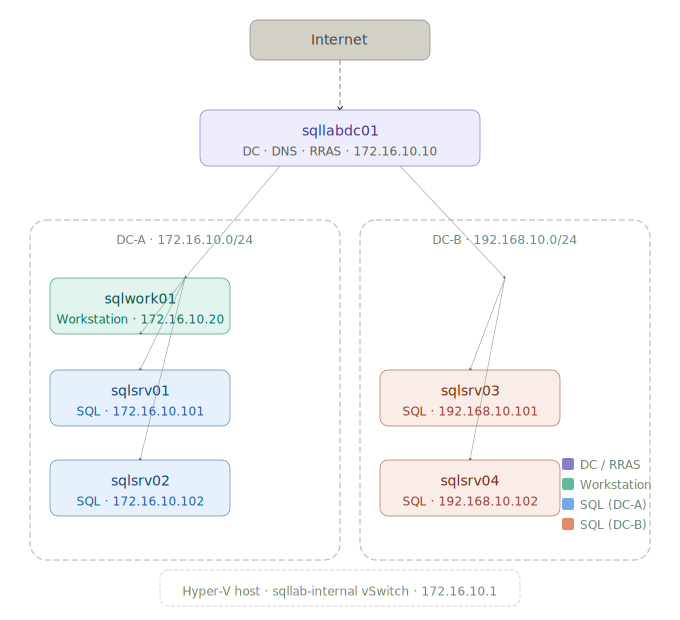

# sqllab.local - Hyper-V Lab Build Instructions

A repeatable, scripted Windows domain lab with a domain controller, Windows Server 2025
workstation, and four SQL Server instances spread across two simulated data centers.

---

## Lab topology

| Hostname | Role | OS | IP | Site |
|---|---|---|---|---|
| sqllabdc01 | Domain controller / DNS / RRAS | Windows Server 2025 | 172.16.10.10 | DC-A |
| sqlwork01 | Workstation | Windows Server 2025 | 172.16.10.20 | DC-A |
| sqlsrv01 | SQL Server (default instance) | Windows Server 2025 | 172.16.10.101 | DC-A |
| sqlsrv02 | SQL Server (default instance) | Windows Server 2025 | 172.16.10.102 | DC-A |
| sqlsrv03 | SQL Server (default instance) | Windows Server 2025 | 192.168.10.101 | DC-B |
| sqlsrv04 | SQL Server (default instance) | Windows Server 2025 | 192.168.10.102 | DC-B |

### Network design



| Item | Value |
|---|---|
| Domain FQDN | sqllab.local |
| Domain NetBIOS | SQLLAB |
| DC-A subnet | 172.16.10.0/24 |
| DC-B subnet | 192.168.10.0/24 |
| DNS server (all VMs) | 172.16.10.10 |
| Default gateway (all VMs) | 172.16.10.10 |
| Internal vSwitch | sqllab-internal |
| External vSwitch | sqllab-external |

All VMs share a single Hyper-V internal vSwitch. The 172 and 192 ranges are
logical subnet labels that emulate two data centers. `sqllabdc01` has two NICs:
one on the internal switch (172.16.10.10) and one on an external switch for
internet access. RRAS on the DC provides NAT and routing for all lab VMs.

---

## Prerequisites

### Software

- Windows 10/11 or Windows Server host with Hyper-V capable hardware
- Hyper-V role enabled (the setup script can enable it for you)
- PowerShell 5.1 or later (run as Administrator)
- ISO files:
  - Windows Server 2025 evaluation: https://www.microsoft.com/en-us/evalcenter/evaluate-windows-server-2025
  - SQL Server 2025 evaluation: https://www.microsoft.com/en-us/evalcenter/evaluate-sql-server-2025

### ISO placement

The default ISO paths are defined in `config.json` (`WS2025ISOPath` and `SQLISOPath`).
The defaults point to:

```
C:\HyperV\ISO\WindowsServer2025.iso
C:\HyperV\ISO\SQL2025DeveloperEnterprise.iso
```

Place your ISO files at those paths, or edit the two keys in `config.json` to point
wherever your ISOs actually live before running any scripts.

### Disk space

| Item | Approximate size |
|---|---|
| WS2025 gold VHDX | 12-15 GB |
| Per-VM differencing disk (all VMs, 64 GB) | 3-20 GB each |
| Total (all 6 VMs + gold image) | ~75-110 GB |

### RAM

| VM | Allocated RAM |
|---|---|
| sqllabdc01 | 4 GB |
| sqlwork01 | 8 GB |
| sqlsrv01-04 | 4 GB each |
| **Total** | **28 GB** |

---

## File inventory

| File | Purpose |
|---|---|
| `config.json` | Lab-wide settings and paths |
| `roles.json` | Per-VM definitions (IP, specs, role, post-config scripts) |
| `00-Setup-LabFolders.ps1` | One-time host prep: folders, Hyper-V, vSwitches, modules |
| `01-New-LabBaseImage.ps1` | Builds a sysprepped gold VHDX from a Windows ISO |
| `02-New-LabVM.ps1` | Creates a differencing disk VM and injects unattend.xml |
| `03-Promote-DC.ps1` | Installs AD DS and promotes the forest |
| `04-Configure-RRAS.ps1` | Installs RRAS, configures NAT and static routes on the DC |
| `05-Join-Domain.ps1` | Joins a VM to sqllab.local and waits for rejoin |
| `06-Install-SQL.ps1` | Unattended SQL Server install using a generated ini file |
| `07-Install-SSMS.ps1` | Downloads and silently installs SSMS 22 on sqlwork01 using the Visual Studio Installer bootstrapper |
| `08-Install-VSCode.ps1` | Installs VS Code, disables AI features, installs extensions on sqlwork01 |
| `09-Install-VisualStudio.ps1` | Installs Visual Studio 2026 Community (.NET desktop + SQL data tools) on sqlwork01 |
| `10-Install-GitHub.ps1` | Installs GitHub Desktop, Git for Windows, and applies git config on sqlwork01 |
| `11-Install-SqlServerModule.ps1` | Installs the SqlServer PowerShell module from PSGallery on sqlwork01 |
| `Verify-Lab.ps1` | Post-deployment verification - confirms all VMs, SQL, and connectivity are healthy |
| `Deploy-Lab.ps1` | Master orchestrator - calls all scripts in order |
| `Remove-Lab.ps1` | Tears down all VMs and disks cleanly |

---

## Step-by-step build

### Step 1 - Seed the secret vault

Run this once on your Hyper-V host before anything else. Each `Set-Secret`
call will prompt you to enter the password securely.

```powershell
# Install modules if not already present
if (-not (Get-Module -ListAvailable Microsoft.PowerShell.SecretManagement)) {
    Install-Module Microsoft.PowerShell.SecretManagement,
                  Microsoft.PowerShell.SecretStore -Force -Scope AllUsers
}

# Remove existing vault if present
if (Get-SecretVault -Name SqlLabVault -ErrorAction SilentlyContinue) {
    Write-Host "Vault 'SqlLabVault' already exists - removing it..."
    Unregister-SecretVault -Name SqlLabVault
    # Also wipe the underlying store so stale secrets don't linger
    Reset-SecretStore -Force
    Write-Host "Vault removed."
}

# Register a fresh vault
Register-SecretVault -Name SqlLabVault -ModuleName Microsoft.PowerShell.SecretStore -DefaultVault
Write-Host "Vault 'SqlLabVault' registered. You will be prompted to set a master password."

# Seed required secrets - each prompt shows the secret name
$secrets = [ordered]@{
    LocalAdminPass  = "Local Administrator password on each VM"
    DomainAdminPass = "SQLLAB\Administrator (after domain promotion)"
    DSSafeModePass  = "Active Directory DSRM password"
    SqlSvcPass      = "SQLLAB\svc-sql service account password"
    SaPassword      = "SQL Server 'sa' login password"
    LabUserPass     = "SQLLAB\sqlpadawan domain user password"
}

foreach ($name in $secrets.Keys) {
    Write-Host "`nSecret : $name"
    Write-Host "Usage  : $($secrets[$name])"
    $value = Read-Host -Prompt "Enter value for '$name'" -AsSecureString
    Set-Secret -Name $name -Secret $value -Vault SqlLabVault
    Write-Host "Stored : $name"
}

Write-Host "`nAll secrets stored in SqlLabVault. Run 'Unlock-SecretVault -Name SqlLabVault' at the start of each new session."
```

> **Note:** The vault master password is required each PowerShell session.
> Run the following at the start of each new session before deploying. The
> `-PasswordTimeout -1` keeps the vault unlocked for the entire session so
> you are not prompted repeatedly during deployment:
> ```powershell
> Unlock-SecretVault -Name SqlLabVault
> Set-SecretStoreConfiguration -Scope CurrentUser -Authentication Password -PasswordTimeout -1 -Confirm:$false
> ```

---

### Step 2 - First-time host setup

> **Skip this step if Hyper-V is already enabled on your host.** `Deploy-Lab.ps1`
> runs `00-Setup-LabFolders.ps1` automatically as its first action, so on a host
> where Hyper-V is already enabled you can go straight to Step 3.

If this is a fresh host with Hyper-V not yet enabled, run this first:

```powershell
.\00-Setup-LabFolders.ps1
```

This script:
- Creates `C:\HyperV\BaseImages`, `C:\HyperV\VMs`, and `C:\HyperV\Disks`
- Enables the Hyper-V Windows feature if not already enabled
- Creates the `sqllab-external` and `sqllab-internal` virtual switches
- Assigns `172.16.10.1/24` to the host vNIC on the internal switch
- Installs the SecretManagement and SecretStore modules

> **If Hyper-V was not already enabled**, a reboot is required before continuing.
> After rebooting, proceed to Step 3 - `Deploy-Lab.ps1` will re-run
> `00-Setup-LabFolders.ps1` idempotently and create the switches before
> provisioning any VMs.

---

### Step 3 - Build gold VHDX images

These are built once and shared by all VMs as differencing disk parents.
Never boot or modify the gold images directly.

The ISO path is read from `WS2025ISOPath` in `config.json`. If you need to
override it for a one-off build, pass `-ISOPath` explicitly:

```powershell
# Uses the path from config.json automatically
.\01-New-LabBaseImage.ps1 -OutputVhdx "C:\HyperV\BaseImages\WS2025-Gold.vhdx"

# Override the ISO path if needed
.\01-New-LabBaseImage.ps1 `
    -ISOPath    "D:\ISOs\WindowsServer2025.iso" `
    -OutputVhdx "C:\HyperV\BaseImages\WS2025-Gold.vhdx"
```

> **Note:** `Deploy-Lab.ps1` enables Hyper-V automatically if it is not already
> enabled, but requires a reboot before continuing. If prompted to reboot, do so
> and re-run the deployment -- it will resume safely from the beginning.

> **Note:** `Deploy-Lab.ps1` enables Hyper-V automatically if it is not already
> enabled, but a reboot is required before the deployment can continue. If prompted
> to reboot, do so and re-run - the deployment will resume safely.

> Building each image takes 10-20 minutes depending on disk speed.

---

### Step 4 - Full automated deployment

Once the gold images exist, run the orchestrator to build the entire lab. ISO paths
are read automatically from `config.json` - no parameters required. Host setup
(vSwitches, host IP, WinRM) runs automatically as the first step:

```powershell
.\Deploy-Lab.ps1
```

If you need to use ISOs from a different location for a single run, you can still
override either path on the command line:

```powershell
.\Deploy-Lab.ps1 `
    -SQLISOPath "D:\ISOs\SQL2025DeveloperEnterprise.iso" `
    -WS2025ISO  "D:\ISOs\WindowsServer2025.iso"
```

The orchestrator runs six stages in order:

| Stage | What happens |
|---|---|
| 1 | Verifies gold images exist (builds them if missing) |
| 2 | Provisions all 6 VMs with differencing disks and unattend.xml |
| 3 | Promotes sqllabdc01 as the sqllab.local domain controller |
| 4 | Configures RRAS (NAT + routing) on sqllabdc01 |
| 5 | Joins all member VMs and the workstation to the domain |
| 6 | Installs SQL Server on sqlsrv01-04; installs SSMS, VS Code, Visual Studio, GitHub, and the SqlServer PowerShell module on sqlwork01 |

Total deployment time is approximately 60-90 minutes.

#### Preview mode (no changes made)

```powershell
.\Deploy-Lab.ps1 -WhatIf
```

#### Skip rebuilding gold images (faster redeployment)

```powershell
.\Deploy-Lab.ps1 -SkipBaseImage
```

---

### Step 5 - Post-deployment verification

From `sqlwork01`, open SSMS and connect to each SQL Server:

| Connection string | Expected result |
|---|---|
| `sqlsrv01` | Connects to default instance |
| `sqlsrv02` | Connects to default instance |
| `sqlsrv03` | Connects to default instance |
| `sqlsrv04` | Connects to default instance |

From `sqllabdc01`, verify domain membership:

```powershell
Get-ADComputer -Filter * | Select-Object Name, DNSHostName | Sort-Object Name
```

Expected output:

```
Name        DNSHostName
----        -----------
SQLLABDC01  sqllabdc01.sqllab.local
SQLSRV01    sqlsrv01.sqllab.local
SQLSRV02    sqlsrv02.sqllab.local
SQLSRV03    sqlsrv03.sqllab.local
SQLSRV04    sqlsrv04.sqllab.local
SQLWORK01   sqlwork01.sqllab.local
```

---

## Running scripts individually

Each script can be called standalone if you need to re-run a single step.

### Provision a single VM

```powershell
$config = Get-Content .\config.json | ConvertFrom-Json
$vm     = (Get-Content .\roles.json | ConvertFrom-Json) | Where-Object Name -eq 'sqlsrv01'
.\02-New-LabVM.ps1 -VMDef $vm -Config $config
```

### Join a single VM to the domain

```powershell
$config = Get-Content .\config.json | ConvertFrom-Json
$vm     = (Get-Content .\roles.json | ConvertFrom-Json) | Where-Object Name -eq 'sqlsrv03'
.\05-Join-Domain.ps1 -VMDef $vm -Config $config
```

### Install SQL Server on a single VM

The ISO path is read from `SQLISOPath` in `config.json`. Pass `-SQLISOPath` to
override it for a one-off run.

```powershell
$config = Get-Content .\config.json | ConvertFrom-Json
$vm     = (Get-Content .\roles.json | ConvertFrom-Json) | Where-Object Name -eq 'sqlsrv02'
.\06-Install-SQL.ps1 -VMDef $vm -Config $config
```

### Install workstation software on sqlwork01

Each tool can be run individually. The `-Extensions` parameter on VS Code
and the `-Workloads` parameter on Visual Studio can be omitted to use the defaults.

```powershell
$config = Get-Content .\config.json | ConvertFrom-Json
$vm     = (Get-Content .\roles.json | ConvertFrom-Json) | Where-Object Name -eq 'sqlwork01'

# Install with default extensions (ms-mssql.mssql,ms-python.python,ms-vscode.powershell,eamodio.gitlens)
.\08-Install-VSCode.ps1 -VMDef $vm -Config $config

# Override extensions for a one-off run
.\08-Install-VSCode.ps1 -VMDef $vm -Config $config `
    -Extensions "ms-mssql.mssql ms-vscode.powershell"

# Install Visual Studio Community (.NET desktop + SQL data tools workloads)
.\09-Install-VisualStudio.ps1 -VMDef $vm -Config $config

# Install GitHub Desktop, Git CLI, and apply git config from config.json
.\10-Install-GitHub.ps1 -VMDef $vm -Config $config

# Install the SqlServer PowerShell module from PSGallery
.\11-Install-SqlServerModule.ps1 -VMDef $vm -Config $config
```

> **Note:** GitHub Desktop requires interactive sign-in the first time it is opened.
> Open GitHub Desktop on sqlwork01 and sign in via **File > Options > Accounts**.
> All other git settings (username, email, default branch) are applied automatically
> from `config.json`.

---

## Verifying the deployment

Run the verification script from the host after deployment completes:

```powershell
.\Verify-Lab.ps1
```

This checks every layer of the lab in sequence - VM state, domain membership,
network routing, SQL Server connectivity, and workstation software - and prints
a pass/fail summary. Any failures include remediation hints.

---

## Tearing down the lab

### Preview what will be removed

```powershell
.\Remove-Lab.ps1 -WhatIf
```

### Remove all VMs and disks, keep gold images

Gold images are preserved so you can redeploy without rebuilding from ISO.

```powershell
.\Remove-Lab.ps1
```

### Full wipe including gold images

```powershell
.\Remove-Lab.ps1 -IncludeGoldImages
```

### Skip the confirmation prompt (automated pipelines)

```powershell
.\Remove-Lab.ps1 -Force
```

> **Warning:** Removal is irreversible. All VM data is permanently deleted.
> The `-WhatIf` flag is strongly recommended for a first review.

---

## Extending the lab

### Adding a new VM

1. Add an entry to `roles.json` following the existing pattern.
2. Run `.\02-New-LabVM.ps1` for the new VM.
3. Run `.\05-Join-Domain.ps1` to join it to the domain.
4. Run any role-specific post-config scripts as needed.

### Adding a second data center subnet

The `Site` field in `roles.json` is already wired for AD Sites and Services.
To make the two subnets properly isolated (useful for AG multi-subnet testing):

1. Create a second internal vSwitch: `New-VMSwitch -Name "sqllab-dcb" -SwitchType Internal`
2. Add a second NIC to `sqllabdc01` connected to `sqllab-dcb`
3. Assign `192.168.10.10` as a static IP on that NIC
4. Update `sqlsrv03` and `sqlsrv04` to connect to `sqllab-dcb` instead of `sqllab-internal`
5. Update their gateway in `roles.json` to `192.168.10.10`

### Adding a D drive later

When a second drive is available, update `config.json` paths to use `D:\HyperV`
and move the existing folders. The differencing disks and gold images can be
moved with Hyper-V offline - just update the VHDX paths in each VM's settings
after the move.

---

## Configuration reference

### config.json

| Key | Default | Description |
|---|---|---|
| DomainFQDN | sqllab.local | Full domain name |
| DomainNetBIOS | SQLLAB | NetBIOS domain name |
| GoldVhdxPath | C:\HyperV\BaseImages\WS2025-Gold.vhdx | Server 2025 base image (all VMs) |
| VMStoragePath | C:\HyperV\VMs | VM configuration files |
| DiffDiskPath | C:\HyperV\Disks | Differencing VHDX files |
| WS2025ISOPath | C:\HyperV\ISO\WindowsServer2025.iso | Windows Server 2025 ISO used to build the gold image |
| SQLISOPath | C:\HyperV\ISO\SQL2025DeveloperEnterprise.iso | SQL Server ISO used by Deploy-Lab.ps1 and 06-Install-SQL.ps1 |
| vSwitchInternal | sqllab-internal | Internal lab switch |
| vSwitchExternal | sqllab-external | External (internet) switch |
| HostInternalIP | 172.16.10.1 | Static IP assigned to the host vNIC on the internal switch - required for PSRemoting to reach lab VMs |
| TimeZone | Eastern Standard Time | Applied via unattend.xml |
| SecretsVault | SqlLabVault | PowerShell SecretStore vault name |
| LabUserName | sqlpadawan | Domain user account created for daily lab use and workstation software installs |
| GitUserName | sqlpadawan | Git global user.name applied to sqlwork01 |
| GitUserEmail | sqlpadawan@gmail.com | Git global user.email applied to sqlwork01 |
| GitDefaultBranch | main | Git global init.defaultBranch applied to sqlwork01 |
| GitAutoCrlf | true | Git global core.autocrlf applied to sqlwork01 |
| DownloadURLs.SSMS | https://aka.ms/ssms/22/release/vs_SSMS.exe | SSMS 22 bootstrapper download URL |
| DownloadURLs.VSCode | https://update.code.visualstudio.com/latest/win32-x64/stable | VS Code installer download URL |
| DownloadURLs.VisualStudio | https://aka.ms/vs/18/Stable/vs_community.exe | Visual Studio 2026 Community bootstrapper download URL |

### VS Code extensions

The default extensions installed by `08-Install-VSCode.ps1` are:

| Extension ID | Description |
|---|---|
| ms-mssql.mssql | SQL Server - IntelliSense, query execution, object explorer |
| ms-python.python | Python language support |
| ms-vscode.powershell | PowerShell language support |
| eamodio.gitlens | Enhanced Git integration and blame annotations |
| streetsidesoftware.code-spell-checker | Spell checking for code and comments |

Override the list at call time with `-Extensions "id1 id2 id3"`.
Find extension IDs on the VS Code marketplace - format is `Publisher.ExtensionName`.

### roles.json fields

| Field | Description |
|---|---|
| Name | Hostname (also used as VM name in Hyper-V) |
| Role | DC, SQL, or Workstation |
| OS | WS2025 (all VMs) |
| IP | Static IPv4 address |
| Gateway | Default gateway (null for the DC itself) |
| PrefixLen | Subnet prefix length (24 = /24) |
| DNS | DNS server IP |
| Site | AD site name (DCA or DCB) |
| MemoryGB | RAM allocation |
| VCPU | Virtual CPU count |
| NICs | Number of network adapters (2 for DC only) |
| DiskSizeGB | OS disk size in GB (defaults to 64 if omitted) |
| PostConfig | Ordered list of post-config scripts to run |

### SQL Server install directories

All SQL Server VMs use the following directory layout:

| Directory | Contents |
|---|---|
| C:\SQLData | User database data files (.mdf, .ndf) |
| C:\SQLLogs | User database log files (.ldf) |
| C:\SQLTempDB | TempDB data and log files |
| C:\SQLBackups | Default backup target |

---

## Secrets reference

| Secret name | Used for |
|---|---|
| LocalAdminPass | Local Administrator password injected via unattend.xml |
| DomainAdminPass | SQLLAB\Administrator - used for PSRemoting after domain join |
| DSSafeModePass | Active Directory DSRM password set during forest promotion |
| SqlSvcPass | Password for the SQLLAB\svc-sql service account |
| SaPassword | SQL Server `sa` login password |
| LabUserPass | Password for the SQLLAB\sqlpadawan domain user account |

---

## Troubleshooting

### WinRM connection times out immediately (before promotion or domain join)

If `Invoke-Command` fails with a WinRM timeout on every VM, the host vNIC on
the internal switch likely has no IP. This is the most common cause of the error:

```
WinRM cannot complete the operation... firewall exception... local subnet
```

Verify:

```powershell
Get-NetIPAddress -InterfaceAlias *sqllab-internal* | Select-Object IPAddress, PrefixLength
```

If the result shows only a `169.254.x.x` link-local address, the host can't reach
the lab subnet. Fix it by running `00-Setup-LabFolders.ps1` (which now assigns the
IP automatically), or assign it manually:

```powershell
$adapter = Get-NetAdapter | Where-Object { $_.Name -like '*sqllab-internal*' }
New-NetIPAddress -InterfaceIndex $adapter.ifIndex -IPAddress 172.16.10.1 -PrefixLength 24
```

Then resume from the failed stage without rebuilding VMs:

```powershell
$config = Get-Content .\config.json | ConvertFrom-Json
$dc     = (Get-Content .\roles.json | ConvertFrom-Json) | Where-Object Role -eq 'DC'
.\03-Promote-DC.ps1 -VMDef $dc -Config $config
```

### WinRM not responding after VM boot

The scripts poll `Test-WSMan` for up to 15 minutes. If a VM exceeds this:

1. Open Hyper-V Manager and check the VM console for errors
2. Verify the unattend.xml was injected correctly - connect to the VM console
   and check `C:\Windows\Panther\unattend.xml`
3. Ensure WinRM is enabled: connect via console and run `winrm quickconfig`

### Domain join fails for DC-B servers (sqlsrv03, sqlsrv04)

These servers are on the `192.168.10.x` range but route through `172.16.10.10`.
Verify that:
1. RRAS is running on `sqllabdc01`: `Get-Service RemoteAccess`
2. IP forwarding is enabled: `Get-NetIPInterface | Select InterfaceAlias, Forwarding`
3. The DC can ping both `192.168.10.101` and `192.168.10.102`

### SQL Server setup fails

Check the SQL Server setup bootstrap log on the target VM:

```powershell
Get-ChildItem "C:\Program Files\Microsoft SQL Server\*\Setup Bootstrap\Log\Summary.txt" |
    Sort-Object LastWriteTime -Descending |
    Select-Object -First 1 |
    Get-Content
```

### Gold VHDX already exists warning

If you need to rebuild a gold image from scratch:

```powershell
# WARNING: This deletes the gold image permanently.
# All differencing disks that depend on it will be broken.
# Remove all dependent VMs first using Remove-Lab.ps1.
Remove-Item "C:\HyperV\BaseImages\WS2025-Gold.vhdx" -Force
```

---

*Generated for sqllab.local Hyper-V lab - sqlpadawan*
